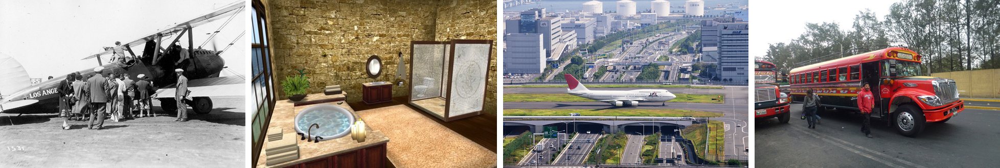

# Pascal VOC 2007

## Introduction
Microsoft COCO is large scale images with Common Objects in Context (COCO), which is one of the most popular image 
datasets out there, with applications like object detection, segmentation, and image caption. The images in the dataset 
are everyday objects captured from everyday scenes. COCO provides multi-object labeling, segmentation mask annotations, 
image captioning, key-point detection and panoptic segmentation annotations with a total of 81 categories, making it a very 
versatile and multi-purpose dataset. More concretely, the dataset contains 122,218 images and covers 80 common 
categories (class 81 is background).

|       |       |       |   | |    |    |    |  |    |
|:-----:|:-----:|:-----:|:-----:|:-----:|:-----:|:-----:|:-----:|:-----:|:-----:|
| airplane: 0  |	 apple: 1 |	 backpack: 2  |	 banana: 3  |	 baseball bat: 4  |	 baseball glove: 5  |	 bear: 6  |	 bed: 7  |	 bench: 8  |	 bicycle: 9  |
| bird: 10  |	 boat: 11 |	 book: 12  |	 bottle: 13  |	 bowl: 14  |	 broccoli: 15  |	 bus: 16  |	 cake: 17  |	 car: 18  |	 carrot: 19  |
| cat: 20  |	 cell phone: 21 |	 chair: 22  |	 clock: 23  |	 couch: 24  |	 cow: 25  |	 cup: 26  |	 dining table: 27  |	 dog: 28  |	 donut: 29  |
| elephant: 30  |	 fire hydrant: 31 |	 fork: 32  |	 frisbee: 33  |	 giraffe: 34  |	 hair drier: 35  |	 handbag: 36  |	 horse: 37  |	 hot dog: 38  |	 keyboard: 39  |
| kite: 40  |	 knife: 41 |	 laptop: 42  |	 microwave: 43  |	 motorcycle: 44  |	 mouse: 45  |	 orange: 46  |	 oven: 47  |	 parking meter: 48  |	 person: 49  |
| pizza: 50  |	 potted plant: 51 |	 refrigerator: 52  |	 remote: 53  |	 sandwich: 54  |	 scissors: 55  |	 sheep: 56  |	 sink: 57  |	 skateboard: 58  |	 skis: 59  |
| snowboard: 60  |	 spoon: 61 |	 sports ball: 62  |	 stop sign: 63  |	 suitcase: 64  |	 surfboard: 65  |	 teddy bear: 66  |	 tennis racket: 67  |	 tie: 68  |	 toaster: 69  |
| toilet: 70  |	 toothbrush: 71 |	 traffic light: 72  |	 train: 73  |	 truck: 74  |	 tv: 75  |	 umbrella: 76  |	 vase: 77  |	 wine glass: 78  |	 zebra: 79  |



For multi-label image classification, MS COCO is further divided into a training set of 82,081 images and a validation set 
of 40,137 images. Since the ground truth annotations of test set are unavailable, we usually train our model on the training 
datasets and evaluate on the validation set. <br />
You can see more detailed description of this dataset on its [website](https://cocodataset.org/). <br />
If you have any questions about this repository, please do not hesitate to contact me by emails (<b><u>zft@cqu.edu.cn</u></b>).


## Run
```sh
python3 main_coco.py
```

## Output
```sh
[dataset] read E:\Dataset\MS-COCO\tmp\data\train_anno.json
[dataset] MS COCO classification set=train number of classes=80  number of images=82081
[dataset] read E:\Dataset\MS-COCO\tmp\data\val_anno.json
[dataset] MS COCO classification set=val number of classes=80  number of images=40137
```

## Tips
Due to the networks reasons or other unexpected circumstances, it may not be able to download the files automatically.
Please download the following files manually and put them in this folder (`$DATA_PATH$`), then `run main_coco.py`.

* `train2014.zip`: training data without annotation ([download](http://images.cocodataset.org/zips/train2014.zip))
* `val2014.zip`: testing data without annotation ([download](http://images.cocodataset.org/zips/val2014.zip))
* `annotations_trainval2014.zip`: annotation of training and validation data ([download](http://images.cocodataset.org/annotations/annotations_trainval2014.zip))


## Experimental Results
These are some works in recent years (rank by time, and only include the papers published in the top journals or top conferences).
           
| No. | Conference |  Method      |mAP  |CP-3 |CR-3 |CF1-3|OP-3 |OR-3 |OF1-3|CP   |CR   |CF1  |OP   |OR   |OF1  |
|:---:|:----------:|:------------:|:---:|:---:|:---:|:---:|:---:|:---:|:---:|:---:|:---:|:---:|:---:|:---:|:---:|
|1    |CVPR-2016   |CNN-RNN       |61.2 |66.0 |55.6 |60.4 |69.2 |66.4 | 67.8|-    | -   |-    | -   | -   | -   |
|2    |CVPR-2016   |ResNet-101    |77.3 |84.1 |59.4 |69.7 |89.1 |62.8 | 73.6|80.2 | 66.7|72.8 | 83.9| 70.8| 76.8|
|3    |ICCV-2017   |RDAR          |73.4 |79.1 |58.7 |67.4 |84.0 |63.0 | 72.0|-    | -   |-    | -   | -   | -   |
|4    |CVPR-2017   |ResNet-SRN-att|76.1 |85.8 |57.5 |66.3 |88.1 |61.1 | 72.1|81.2 | 63.3|70.0 | 84.1| 67.7| 75.0|
|4    |CVPR-2017   |ResNet-SRN    |77.1 |85.2 |58.8 |67.4 |87.4 |62.5 | 72.9|81.6 | 65.4|71.2 | 82.7| 69.9| 75.8|
|5    |AAAI-2018   |Order-Free RNN|-    |71.6 |54.8 |62.1 |74.2 |62.2 | 67.7|-    | -   |-    | -   | -   | -   |
|6    |CVPR-2018   |ML-ZSL        |-    |74.1 |64.5 |69.0 |-    |-    | -   |-    | -   |-    | -   | -   | -   |
|7    |CVPR-2018   |Multi-Evidence|-    |84.5 |62.2 |70.6 |89.1 |64.3 | 74.7|80.4 | 70.2|74.9 | 85.2| 72.5| 78.4|
|8    |TMM-2018    |RLSD          |68.2 |67.6 |57.2 |62.0 |70.1 |63.4 | 66.5|-    | -   |-    | -   | -   | -   |
|9    |AAAI-2018   |RARL          |-    |78.8 |57.2 |66.2 |84.0 |61.6 | 71.1|-    | -   |-    | -   | -   | -   |
|10   |ACM MM-2018 |KD-WSD        |74.6 |-    |-    |66.8 |-    |-    | 72.7|-    | -   |69.2 | -   | -   | 74.0|
|11   |PR-2019     |DELTA         |71.3 |-    |-    |-    |-    |-    | -   |-    | -   |-    | -   | -   | -   |
|12   |CVPR-2019   |ResNet101-ACfs|77.5 |85.2 |59.4 |68.0 |86.6 |63.3 | 73.1|77.4 | 68.3|72.2 | 79.8| 73.1| 76.3|
|13   |CVPR-2019   |ML-GCN        |83.0 |89.2 |64.1 |74.6 |90.5 |66.5 | 76.7|85.1 | 72.0|78.0 | 85.8| 75.4| 80.3|
|14   |ICCV-2019   |SSGRL         |83.8 |91.9 |62.5 |72.7 |93.8 |64.1 | 76.2|89.9 | 68.5|76.8 | 91.3| 70.8| 79.7|
|15   |CVPR-2020   |PLA           |-    |80.4 |68.9 |74.2 |81.5 |73.3 | 77.1|-    | -   |-    | -   | -   | -   |
|16   |TSMCS-2020  |CoP           |81.1 |86.4 |62.9 |72.7 |88.7 |65.1 | 75.1|81.2 | 70.8|75.8 | 83.6| 73.3| 78.1|
|17   |PR-2020     |CNN-RMLC      |75.2 |64.9 |62.0 |61.5 |64.1 |66.8 | 65.5|-    | -   |-    | -   | -   | -   |
|18   |ACM MM-2020 |AdaHGNN       |85.0 |-    |-    |75.5 |-    |-    | 77.6|-    | -   |79.9 | -   | -   | 81.8|
|19   |ECCV-2020   |ADD-GCN       |85.2 |88.8 |66.2 |75.8 |90.3 |68.5 | 77.9|84.7 | 75.9|80.1 | 84.9| 79.4| 82.0|
|20   |AAAI-2020   |KSSNet        |83.7 |-    |-    |-    |-    |-    | -   |84.6 | 73.2|77.2 | 87.8| 76.2| 81.5|
|21   |AAAI-2021   |DSDL          |81.7 |88.1 |62.9 |73.4 |89.6 |65.3 | 75.6|84.1 | 70.4|76.7 | 85.1| 73.9| 79.1|                    
|22   |TPAMI-2021  |P-GCN         |83.2 |89.2 |64.3 |74.8 |90.0 |66.8 | 76.7|84.9 | 72.7|78.3 | 85.0| 76.4| 80.5|                    


## References
1. Wang J, Yang Y, Mao J, et al. Cnn-rnn: A unified framework for multi-label image classification[C]//Proceedings of the IEEE conference on computer vision and pattern recognition. 2016: 2285-2294.
2. He K, Zhang X, Ren S, et al. Deep residual learning for image recognition[C]//Proceedings of the IEEE conference on computer vision and pattern recognition. 2016: 770-778.
3. Wang Z, Chen T, Li G, et al. Multi-label image recognition by recurrently discovering attentional regions[C]//Proceedings of the IEEE international conference on computer vision. 2017: 464-472.
4. Zhu F, Li H, Ouyang W, et al. Learning spatial regularization with image-level supervisions for multi-label image classification[C]//Proceedings of the IEEE Conference on Computer Vision and Pattern Recognition. 2017: 5513-5522.
5. Chen S F, Chen Y C, Yeh C K, et al. Order-free RNN with visual attention for multi-label classification[C]//Proceedings of the AAAI Conference on Artificial Intelligence. 2018, 32(1).
6. Lee C W, Fang W, Yeh C K, et al. Multi-label zero-shot learning with structured knowledge graphs[C]//Proceedings of the IEEE conference on computer vision and pattern recognition. 2018: 1576-1585.
7. Ge W, Yang S, Yu Y. Multi-evidence filtering and fusion for multi-label classification, object detection and semantic segmentation based on weakly supervised learning[C]//Proceedings of the IEEE Conference on Computer Vision and Pattern Recognition. 2018: 1277-1286.
8. Zhang J, Wu Q, Shen C, et al. Multilabel image classification with regional latent semantic dependencies[J]. IEEE Transactions on Multimedia, 2018, 20(10): 2801-2813.
9. Chen T, Wang Z, Li G, et al. Recurrent attentional reinforcement learning for multi-label image recognition[C]//Proceedings of the AAAI Conference on Artificial Intelligence. 2018, 32(1).
10. Liu Y, Sheng L, Shao J, et al. Multi-label image classification via knowledge distillation from weakly-supervised detection[C]//Proceedings of the 26th ACM international conference on Multimedia. 2018: 700-708.
11. Yu W J, Chen Z D, Luo X, et al. DELTA: A deep dual-stream network for multi-label image classification[J]. Pattern Recognition, 2019, 91: 322-331.
12. Guo H, Zheng K, Fan X, et al. Visual attention consistency under image transforms for multi-label image classification[C]//Proceedings of the IEEE/CVF Conference on Computer Vision and Pattern Recognition. 2019: 729-739.
13. Chen Z M, Wei X S, Wang P, et al. Multi-label image recognition with graph convolutional networks[C]//Proceedings of the IEEE/CVF Conference on Computer Vision and Pattern Recognition. 2019: 5177-5186.
14. Chen T, Xu M, Hui X, et al. Learning semantic-specific graph representation for multi-label image recognition[C]//Proceedings of the IEEE/CVF International Conference on Computer Vision. 2019: 522-531.
15. Yazici V O, Gonzalez-Garcia A, Ramisa A, et al. Orderless recurrent models for multi-label classification[C]//Proceedings of the IEEE/CVF Conference on Computer Vision and Pattern Recognition. 2020: 13440-13449.
16. Wen S, Liu W, Yang Y, et al. Multilabel image classification via feature/label co-projection[J]. IEEE Transactions on Systems, Man, and Cybernetics: Systems, 2020.
17. Cevikalp H, Benligiray B, Gerek O N. Semi-supervised robust deep neural networks for multi-label image classification[J]. Pattern Recognition, 2020, 100: 107164.
18. Wu X, Chen Q, Li W, et al. AdaHGNN: Adaptive Hypergraph Neural Networks for Multi-Label Image Classification[C]//Proceedings of the 28th ACM International Conference on Multimedia. 2020: 284-293.
19. Ye J, He J, Peng X, et al. Attention-Driven Dynamic Graph Convolutional Network for Multi-Label Image Recognition[C]//European Conference on Computer Vision. Springer, Cham, 2020: 649-665.
20. Wang Y, He D, Li F, et al. Multi-label classification with label graph superimposing[C]//Proceedings of the AAAI Conference on Artificial Intelligence. 2020, 34(07): 12265-12272.
21. Zhou F, Huang S, Xing Y. Deep Semantic Dictionary Learning for Multi-label Image Classification[J]. arXiv preprint arXiv:2012.12509, 2020.
22. Chen Z, Wei X S, Wang P, et al. Learning Graph Convolutional Networks for Multi-Label Recognition and Applications[J]. IEEE Transactions on Pattern Analysis and Machine Intelligence, 2021.
