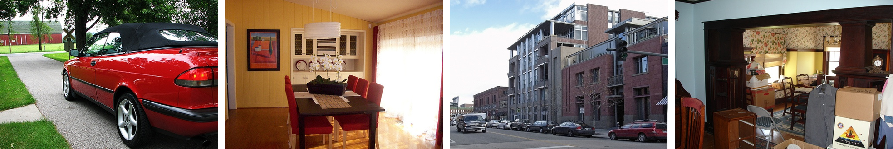

# Pascal VOC 2007

## Introduction

Pascal VOC 2007 dataset is a benchmark in the field of computer vision, which is widely used in image classification,
object detection, target segmentation and other tasks, which contains four categories: Vehicle, Indoor, Animal,
Person, and can be subdivided into **20 classes**.

* Person: person
* Animal: bird, cat, cow, dog, horse, sheep
* Vehicle: aeroplane, bicycle, boat, bus, car, motorbike, train
* Indoor: bottle, chair, dining table, potted plant, sofa, tv/monitor



For multi-label image classification, VOC 2007 dataset is divided into
**training (2,501)**, **validation (2,510)** and **testing (4,952)** sets. Following the previous work, we usually use the train and
validate set to train our model, and evaluate the classification performance on the test set.<br />
You can see more detailed description of this dataset on its [website](http://host.robots.ox.ac.uk/pascal/VOC/voc2007/). <br />
If you have any questions about this repository, please do not hesitate to contact me by emails (<b><u>zft@cqu.edu.cn</u></b>).

## Run
```sh
python3 main_voc2007.py
```

## Output
```sh
[dataset] read data\files\VOC2007\classification_trainval.csv
[dataset] VOC 2007 classification set=trainval number of classes=20  number of images=5011
[dataset] read data\files\VOC2007\classification_test.csv
[dataset] VOC 2007 classification set=test number of classes=20  number of images=4952
```

## Tips
Due to the networks reasons or other unexpected circumstances, it may not be able to download the files automatically.
Please download the following files manually and put them in this folder (`$DATA_PATH$`), then `run main_voc2007.py`.

* `VOCtrainval_06-Nov-2007.tar`: training/validation data ([download](http://host.robots.ox.ac.uk/pascal/VOC/voc2007/VOCtrainval_06-Nov-2007.tar))
* `VOCtest_06-Nov-2007.tar`: testing data without annotation ([download](http://host.robots.ox.ac.uk/pascal/VOC/voc2007/VOCtest_06-Nov-2007.tar))
* `VOCtestnoimgs_06-Nov-2007.tar`: annotation of testing data ([download](http://host.robots.ox.ac.uk/pascal/VOC/voc2007/VOCtestnoimgs_06-Nov-2007.tar))
* `VOCdevkit_18-May-2011.tar`: development kit code and documentation ([download](http://host.robots.ox.ac.uk/pascal/VOC/voc2012/VOCdevkit_18-May-2011.tar))

## Experimental Results
These are some works in recent years (rank by time, and only include the papers published in the top journals or top conferences).

| No. | Conference |    Method    | aero  |  bike |  bird |  boat | bottle|  bus  |  car  |  cat  | chair |  cow  | table |  dog  | horse | motor | person| plant | sheep |  sofa | train |   tv  | mAP |
|:---:|:----------:|:------------:|:-----:|:-----:|:-----:|:-----:|:-----:|:-----:|:-----:|:-----:|:-----:|:-----:|:-----:|:-----:|:-----:|:-----:|:-----:|:-----:|:-----:|:-----:|:-----:|:-----:|:---:|
|  1  |ICLR-2014   |VeryDeep      | 98.9  |	95.0  |	96.8  |	95.4  |	69.7  |	90.4  |	93.5  |	96.0  |	74.2  |	86.6  |	87.8  |	96.0  |	96.3  |	93.1  |	97.2  |	70.0  |	92.1  |	80.3  |	98.1  |	87.0  |	89.7|
|  2  |TPAMI-2015  |HCP           | 98.6  |	97.1  |	98.0  |	95.6  |	75.3  |	94.7  |	95.8  |	97.3  |	73.1  |	90.2  |	80.0  |	97.3  |	96.1  |	94.9  |	96.3  |	78.3  |	94.7  |	76.2  |	97.9  |	91.5  |	90.9|
|  3  |CVPR-2016   |CNN-RNN       | 96.7  |	83.1  |	94.2  |	92.8  |	61.2  |	82.1  |	89.1  |	94.2  |	64.2  |	83.6  |	70.0  |	92.4  |	91.7  |	84.2  |	93.7  |	59.8  |	93.2  |	75.3  |	99.7  |	78.6  |	84.0|
|  4  |CVPR-2016   |ResNet-101    | 99.5  |	97.7  |	97.8  |	96.4  |	65.7  |	91.8  |	96.1  |	97.6  |	74.2  |	80.9  |	85.0  |	98.4  |	96.5  |	95.9  |	98.4  |	70.1  |	88.3  |	80.2  |	98.9  |	89.2  |	89.9|
|  5  |CVPR-2016   |FeV+LV        | 97.9  |	97.0  |	96.6  |	94.6  |	73.6  |	93.9  |	96.5  |	95.5  |	73.7  |	90.3  |	82.8  |	95.4  |	97.7  |	95.9  |	98.6  |	77.6  |	88.7  |	78.0  |	98.3  |	89.0  |	90.6|
|  6  |TIP-2016    |RCP           | 99.3  |	97.6  |	98.0  |	96.4  |	79.3  |	93.8  |	96.6  |	97.1  |	78.0  |	88.7  |	87.1  |	97.1  |	96.3  |	95.4  |	99.1  |	82.1  |	93.6  |	82.2  |	98.4  |	92.8  |	92.5|
|  7  |ICCV-2017   |RDAR          | 98.6  |	97.4  |	96.3  |	96.2  |	75.2  |	92.4  |	96.5  |	97.1  |	76.5  |	92.0  |	87.7  |	96.8  |	97.5  |	93.8  |	98.5  |	81.6  |	93.7  |	82.8  |	98.6  |	89.3  |	91.9|
|  8  |AAAI-2018   |RMIC          | 97.1  |	91.3  |	94.2  |	57.1  |	86.7  |	90.7  |	93.1  |	63.3  |	83.3  |	76.4  |	92.8  |	94.4  |	91.6  |	95.1  |	92.3  |	59.7  |	86.0  |	69.5  |	96.4  |	79.0  |	84.5|
|  9  |TMM-2018    |RLSD          | 96.4  |	92.7  |	93.8  |	94.1  |	71.2  |	92.5  |	94.2  |	95.7  |	74.3  |	90.0  |	74.2  |	95.4  |	96.2  |	92.1  |	97.9  |	66.9  |	93.5  |	73.7  |	97.5  |	87.6  |	88.5|
|  10 |AAAI-2018   |RARL          | 98.6  |	97.1  |	97.1  |	95.5  |	75.6  |	92.8  |	96.8  |	97.3  |	78.3  |	92.2  |	87.6  |	96.9  |	96.5  |	93.6  |	98.5  |	81.6  |	93.1  |	83.2  |	98.5  |	89.3  |	92.0|
|  11 |CVPR-2019   |ML-GCN        | 99.5  |	98.5  |	98.6  |	98.1  |	80.8  |	94.6  |	97.2  |	98.2  |	82.3  |	95.7  |	86.4  |	98.2  |	98.4  |	96.7  |	99.0  |	84.7  |	96.7  |	84.3  |	98.9  |	93.7  |	94.0|
|  12 |ICCV-2019   |SSGRL         | 99.5  |	97.1  |	97.6  |	97.8  |	82.6  |	94.8  |	96.7  |	98.1  |	78.0  |	97.0  |	85.6  |	97.8  |	98.3  |	96.4  |	98.8  |	84.9  |	96.5  |	79.8  |	98.4  |	92.8  |	93.4|
|  12 |ICCV-2019   |SSGRL-Pre     | 99.7  |	98.4  |	98.0  |	97.6  |	85.7  |	96.2  |	98.2  |	98.8  |	82.0  |	98.1  |	89.7  |	98.8  |	98.7  |	97.0  |	99.0  |	86.9  |	98.1  |	85.8  |	99.0  |	93.7  |	95.0|
|  13 |TSMCS-2020  |CoP           | 99.9  |	98.4  |	97.8  |	98.8  |	81.2  |	93.7  |	97.1  |	98.4  |	82.7  |	94.6  |	87.1  |	98.1  |	97.6  |	96.2  |	98.8  |	83.2  |	96.2  |	84.7  |	99.1  |	93.5  |	93.8|
|  14 |ACM MM-2020 |AdaHGNN       | 99.8  |	98.9  |	98.9  |	98.1  |	88.1  |	97.3  |	98.3  |	98.8  |	81.7  |	98.2  |	87.2  |	99.1  |	99.3  |	97.7  |	99.1  |	87.8  |	98.4  |	82.5  |	99.7  |	94.5  |	95.2|
|  15 |ECCV-2020   |ADD-GCN       | 99.8  |	99.0  |	98.4  |	99.0  |	86.7  |	98.1  |	98.5  |	98.3  |	85.8  |	98.3  |	88.9  |	98.8  |	99.0  |	97.4  |	99.2  |	88.3  |	98.7  |	90.7  |	99.5  |	97.0  |	96.0|
|  16 |AAAI-2021   |DSDL          | 99.8  |	98.7  |	98.4  |	97.9  |	81.9  |	95.4  |	97.6  |	98.3  |	83.3  |	95.0  |	88.6  |	98.0  |	97.9  |	95.8  |	99.0  |	86.6  |	95.9  |	86.4  |	98.6  |	94.4  |	94.4|
|  17 |TPAMI-2021  |P-GCN         | 99.6  |	98.6  |	98.4  |	98.7  |	81.5  |	94.8  |	97.6  |	98.2  |	83.1  |	96.0  |	87.1  |	98.3  |	98.5  |	96.3  |	99.1  |	87.3  |	95.5  |	85.4  |	98.9  |	93.6  |	94.3|

## References
1. Simonyan K, Zisserman A. Very deep convolutional networks for large-scale image recognition[J]. arXiv preprint arXiv:1409.1556, 2014.<br />
2. Wei Y, Xia W, Lin M, et al. HCP: A flexible CNN framework for multi-label image classification[J]. IEEE transactions on pattern analysis and machine intelligence, 2015, 38(9): 1901-1907.<br />
3. Wang J, Yang Y, Mao J, et al. Cnn-rnn: A unified framework for multi-label image classification[C]//Proceedings of the IEEE conference on computer vision and pattern recognition. 2016: 2285-2294.<br />
4. He K, Zhang X, Ren S, et al. Deep residual learning for image recognition[C]//Proceedings of the IEEE conference on computer vision and pattern recognition. 2016: 770-778.<br />
5. Yang H, Tianyi Zhou J, Zhang Y, et al. Exploit bounding box annotations for multi-label object recognition[C]//Proceedings of the IEEE Conference on Computer Vision and Pattern Recognition. 2016: 280-288.<br />
6. Wang M, Luo C, Hong R, et al. Beyond object proposals: Random crop pooling for multi-label image recognition[J]. IEEE Transactions on Image Processing, 2016, 25(12): 5678-5688.<br />
7. Wang Z, Chen T, Li G, et al. Multi-label image recognition by recurrently discovering attentional regions[C]//Proceedings of the IEEE international conference on computer vision. 2017: 464-472.<br />
8. He S, Xu C, Guo T, et al. Reinforced multi-label image classification by exploring curriculum[C]//Proceedings of the AAAI Conference on Artificial Intelligence. 2018, 32(1).<br />
9. Zhang J, Wu Q, Shen C, et al. Multilabel image classification with regional latent semantic dependencies[J]. IEEE Transactions on Multimedia, 2018, 20(10): 2801-2813.<br />
10. Chen T, Wang Z, Li G, et al. Recurrent attentional reinforcement learning for multi-label image recognition[C]//Proceedings of the AAAI Conference on Artificial Intelligence. 2018, 32(1).<br />
11. Chen Z M, Wei X S, Wang P, et al. Multi-label image recognition with graph convolutional networks[C]//Proceedings of the IEEE/CVF Conference on Computer Vision and Pattern Recognition. 2019: 5177-5186.<br />
12. Chen T, Xu M, Hui X, et al. Learning semantic-specific graph representation for multi-label image recognition[C]//Proceedings of the IEEE/CVF International Conference on Computer Vision. 2019: 522-531.<br />
13. Wen S, Liu W, Yang Y, et al. Multilabel image classification via feature/label co-projection[J]. IEEE Transactions on Systems, Man, and Cybernetics: Systems, 2020.<br />
14. Wu X, Chen Q, Li W, et al. AdaHGNN: Adaptive Hypergraph Neural Networks for Multi-Label Image Classification[C]//Proceedings of the 28th ACM International Conference on Multimedia. 2020: 284-293.<br />
15. Ye J, He J, Peng X, et al. Attention-Driven Dynamic Graph Convolutional Network for Multi-Label Image Recognition[C]//European Conference on Computer Vision. Springer, Cham, 2020: 649-665.<br />
16. Zhou F, Huang S, Xing Y. Deep Semantic Dictionary Learning for Multi-label Image Classification[J]. arXiv preprint arXiv:2012.12509, 2020.<br />
17. Chen Z, Wei X S, Wang P, et al. Learning Graph Convolutional Networks for Multi-Label Recognition and Applications[J]. IEEE Transactions on Pattern Analysis and Machine Intelligence, 2021.<br />

